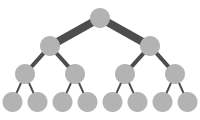
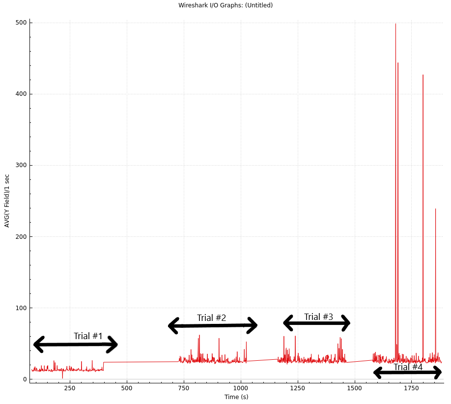

# 
**BGP with ECMP in the Datacenter**
 
 By Julian Mato-Hernandez & Evan Jurdan 

# Table of Contents:
- [Introduction](#introduction)
- [Technology Used](#technology-used)           
    - [Clos & Fat Tree](#clos--fat-tree) 
    - [BGP & EBGP](#bgp--ebgp)
    - [Full Mesh & Partial Mesh](#full-mesh--partial-mesh)
    - [ECMP Load Sharing](#ecmp-load-sharing)
- [Experiments](#experiments)
    - [Topology Description and Specifications](#topology-description-and-specifications)
    - [Link Breakage from Spine to Leaf and from Leaf to ToR](#link-breakage-from-spine-to-leaf-and-from-leaf-to-tor---experiment)
    - [RTT With BGP & ECMP](#rtt-with-bgp--ecmp---experiment)
    - [ECMP Load Balancing Efficiency](#ecmp-load-balancing-efficiency---experiment)
- [Results](#results)
    - [Link Breakage from Spine to Leaf and from Leaf to ToR](#link-breakage-from-spine-to-leaf-and-from-leaf-to-tor---result)
    - [RTT With BGP & ECMP](#rtt-with-bgp--ecmp---result)
    - [ECMP Load Balancing Efficiency](#ecmp-load-balancing-efficiency---result)
- [Critical Summary](#critical-summary)
- [References](#references)
- [Appendix](#appendix)
 
 
 

# Introduction:
This paper talks about the use of ECMP in a BGP Clos network. In this three tiered Clos topology developed with cisco nexus 9000s running NXOS v9.3.1 we ran BGP on it and added ECMP to it. ECMP is used here to help utilize under utilized resources and to almost double throughput. With the three tiered Clos With just BGP there are lots of redundant connections that aren't being utilized unless something breaks. The addition of ECMP allows the network to utilize the unused connections to increase throughput.
 
 
 

# Technology Used:
## Clos & Fat Tree -
Fat Tree(A subset of Clos topologies) relies heavily on route consolidation. more specifically as you see in figure 1 each level has a "thicker" connection than the last. Clos and therefore Fat Tree traditionally use a 2 or 3 tiered network structure with the "Spine" being at the top followed by "leafs" and in a 3 tiered Clos a final ToR layer. The Spine acts as the main distribution between otherwise isolated pods of systems. The leafs are the aggregation layer, they collect and truncate traffic from the ToR layer to pass it through to the Spine. Leaf layers are also responsible for any IP Sec or other security measures implemented by the system, this is crucial due to the need to keep the Spine as secure as possible. With the specialized nature of each layer relatively, specific hardware considerations have to be made, the Spine needs relatively few connections but needs massive bandwidth to handle the aggregated leaf layer traffic, leaf layers need a large number of ports to accommodate as many hosts or ToR's with a limited number of high-speed links to the Spine, and finally, the ToR layer only needs a large number of low-speed connections. By having all of your traffic aggregate adding new portions to the network is trivial giving Clos tremendous scalability while remaining structured and organized.

        
Figure-1
 
 

## BGP & EBGP -
BGP "is the routing protocol that glues together the net-works forming the Internet"(Garcia-Martinez and Bagnulo 2432). BGP works on the concept of neighbors, route advertisements, hello timers, and route flooding. To be exact we are using EBGP to simplify our topology, in brief, EBGP advertises and re-advertises routes to all BGP-enabled devices. A neighbor in BGP is simply the next hop or directly adjacent BGP aware device that a BGP device has established trust with, to establish a trust a BGP device must know the device's correct AS or Autonomous System number and the IP address of the connecting link. This is how BGP maintains its isolation from other BGP or malicious networks, without intimate knowledge of the network, not much can be done. Route advertisements are as they sound, when a BGP device wants to share the location of a network directly attached to them they can advertise it to the network thus propagating its location across all BGP routing tables. Hello timers are packets sent from neighbor to neighbor to simply affirm its continued function in the network, normally hello timers are sent at a predefined interval and if ever 3 acknowledgments are missed in a row the network is flooded with a route change. Finally, flooding is the act of propagating information to all systems on the network.
 
 

## Full Mesh & Partial Mesh -
Full Mesh is a term to refers to the total interconnection of all nodes in a network as shown in figure 2. This allows for maximum points of redundancy in case of a link failure, for this reason, all the pods in a Clos or Fat Tree topology are interconnected. This is best practice in most networks, though it does bring with it some issues namely loops. A large issue with full mesh is the existence of loops in the network leaving the opportunity for packets to get lost in limbo slowing down the network and eventually crashing the machines tunning it. As to avoid this we have loop avoidance protocols but by adding another protocol to your network you are adding latency, and unfortunately the more links the longer convergence could take as the protocol searches for a new route. this can be mitigated by adding link state costs to narrow the decision tree but if done correctly in a 3 tier Clos topology the redundancy already present at the spine a partial mesh can be used while maintaining redundancy. Partial Mesh as it sounds only connects a portion of the systems together leaving a higher chance of failure unless accounted for though it does alleviate network complexity and convergence time at times.

             
Figure-2
 
 

## ECMP Load Sharing -
ECMP is a protocol that allows traffic to flow over multiple equal cost paths in one session. ECMP stands for Equal-Cost Multipath and is a routing technology that helps decide what next hop data should take. It is used to increase network speed and to utilize all of the links in a network instead of only a few key links. In our network we chose to hash the packets per destination IP and destination port. The hash is checked at the end of the journey to make sure that the hash is checked to make sure the packet/file is correctly delivered. A single TCP session will take the same link to get to a host but if another session is opened it can take a different path. ECMP keeps the traffic heading to the same destination IP and Port in the same link but if there is any traffic for another destination or the same destination but a different port it can send that traffic through a different link. Rotate is used so that the computer doesn't keep picking the same link to transmit over as computers are bad at true randomization. The rotate is a 64 bit stream that is cycled to make the selection more varied. since we have it set to 32 that means it starts at 32 and will cycle through with each packet, and the number will influence the link selected. The hashing seed will just help to add complexity to hashing and make sure that the hashing can't be spoofed. Load sharing mode is how we are load sharing and that could be by packet or by destination etc. we are load sharing by destination IP and destination port. That means as discussed earlier that if traffic has the same destination and port it will go through the same link but if other traffic is generated it will try and spread traffic through equal cost links. ECMP is not usually able to load balance between different ASs. There is a special command ("bestpath as-path multipath-relax") that enables it to go between different Autonomous systems in our BGP network. In our routing table if an entry has a line like this | in an entry it mean that there is ECMP to that link and that it will multipath to it.
 
 
 

# Experiments:

## Topology Description and Specifications -
 

### *Spine*
| Host Name | Interface 1(E1/1) | Mask | Interface 2(E1/2) | Mask | Interface 3(E1/3) | Mask | AS # |
| :--- | ---: | :--- | ---: | :--- | ---: | :--- | :---: |
| N-1_S-1 | 1.1.1.1 | /30 | 1.1.1.5 | /30 | 1.1.1.9 | /30 | 124 |
| N-1_S-2 | 1.1.1.13 | /30 | 1.1.1.17 | /30 | 1.1.1.21 | /30 | 149 |
| N-1_S-3 | 1.1.1.25 | /30 | 1.1.1.29 | /30 | 1.1.1.33 | /30 | 174 |
| N-1_S-4 | 1.1.1.37 | /30 | 1.1.1.41 | /30 | 1.1.1.45 | /30 | 199 |             
 

### *Leaf*
| Host Name | Interface 1(E1/1) | Mask | Interface 2(E1/2) | Mask | Interface 3(E1/3) | Mask | Interface 4(E1/4) | Mask | Interface 5(E1/5) | Mask | AS # |
| :--- | ---: | :--- | ---: | :--- | ---: | :--- | ---: | :--- | ---: | :--- | :---: |
| N-1_P-1_L-1 | 1.1.1.2 | /30 | 1.1.1.26 | /30 | 2.1.1.1 | /30 | 2.1.3.1 | /30 | 2.1.2.1 | /30 | 216 |
| N-1_P-1_L-2 | 1.1.1.14 | /30 | 1.1.1.38 | /30 | 2.2.3.1 | /30 | 2.2.1.1 | /30 | 2.2.2.1 | /30 | 232 |
| N-1_P-2_L-3 | 1.1.1.6 | /30 | 1.1.1.30 | /30 | 2.3.4.1 | /30 | 2.3.6.1 | /30 | 2.3.5.1 | /30 | 248 |
| N-1_P-2_L-4 | 1.1.1.18 | /30 | 1.1.1.42 | /30 | 2.4.6.1 | /30 | 2.4.4.1 | /30 | 2.4.5.1 | /30 | 264 |
| N-1_P-3_L-5 | 1.1.1.10 | /30 | 1.1.1.34 | /30 | 2.5.7.1 | /30 | 2.5.9.1 | /30 | 2.5.8.1 | /30 | 280 |
| N-1_P-3_L-6 | 1.1.1.22 | /30 | 1.1.1.46 | /30 | 2.6.9.1 | /30 | 2.6.7.1 | /30 | 2.6.8.1 | /30 | 296 |             
 

### *ToR*
| Host Name | Interface 1(E1/1) | Mask | Interface 2(E1/2) | Mask | Interface 3(E1/3) | Mask | AS # | Advertised Network's |
| :--- | ---: | :--- | ---: | :--- | ---: | :--- | :---: | :--- |
| ToR-1 | 2.1.1.2 | /30 | 2.2.1.2 | /30 | 192.1.1.254 | /24 | 311 | 192.1.1.0/24 |
| ToR-2 | 2.1.2.2 | /30 | 2.2.2.2 | /30 | 192.1.2.254 | /24 | 322 | 192.1.2.0/24 |
| ToR-3 | 2.2.3.2 | /30 | 2.1.3.2 | /30 | 192.1.3.254 | /24 | 333 | 192.1.3.0/24 |
| ToR-4 | 2.3.4.2 | /30 | 2.4.4.2 | /30 | 192.2.4.254 | /24 | 344 | 192.2.4.0/24 |
| ToR-5 | 2.3.5.2 | /30 | 2.4.5.2 | /30 | 192.2.5.254 | /24 | 355 | 192.2.5.0/24 |
| ToR-6 | 2.4.6.2 | /30 | 2.3.6.2 | /30 | 192.2.6.254 | /24 | 366 | 192.2.6.0/24 |
| ToR-7 | 2.5.7.2 | /30 | 2.6.7.2 | /30 | 192.3.7.254 | /24 | 377 | 192.3.7.0/24 |
| ToR-8 | 2.5.8.2 | /30 | 2.6.8.2 | /30 | 192.3.8.254 | /24 | 388 | 192.3.8.0/24 |
| ToR-9 | 2.6.9.2 | /30 | 2.5.9.2 | /30 | 192.3.9.254 | /24 | 399 | 192.3.9.0/24 |             
 

             
Figure-3
 
 

## Link Breakage from Spine to Leaf and from Leaf to ToR - Experiment -              
One of the main features of a meshed topology and BGP is to be able to re-establish connection after a broken link, so for this experiment, we will be testing that ability. To start large amounts of traffic will be generated from PoD-1(host-1) to PoD-1(host-3) and then from PoD-1(host-1) to PoD-2(host-4). Once the traffic starts to be generated a link is broken. The final packet sent is logged as the "Time of Disconnect" and once the connection is re-established the first newly received packet is logged as "Time of Re-connect". The difference between the two numbers should be an accurate convergence time. 
 

In this topology EBGP is set to have a Hello timer interval of 10 sec and an LSA interval of 32 sec, an optimal convergence time would be 32 sec.
 
 

## RTT With BGP & ECMP - Experiment -          
In this experiment we will test the speed and stability of the network by extrapolating the Round Trip Time(RTT) of a stream of traffic across two pods, The best outcome would be a low latency and stable connection with few to no spikes in RTT. Given that we are in a virtual environment with limited data transfer speeds and occasional errors due to virtualization the best outcome is unlikely, rather the mor likely outcome is that there will be an unusually high RTT but it will retain a relatively stable connection speed. 
 
 

## ECMP Load Balancing Efficiency - Experiment -          
The main feature of load sharing is its ability to spread the network load to multiple devices/paths. To visualize this there will be one host pinging two other host's on two other pods. If ECMP is working correctly each outgoing ECMP connection should be established on different links, and each returning ACK should not be limited to the same path as the outgoing packets. 
 
 
 

# Results:

## Link Breakage from Spine to Leaf and from Leaf to ToR - Result -              
As shown from the chart bellow the Convergence time varies from a Back-Bone <-> Leaf and a Leaf <-> ToR disconnect by an average of 3 seconds. This though unexpected is not unreasonable, having to send data through the two pods and the core makes the number of devices that need there routing tables updated to retain service are doubled compared to a single pod. On the other hand a sub 30 sec convergence time is very strange, my hypotheses is that in some way the link was broken between the sending of a hello msg and the response or ECMP found a new route before BGP could flood the networks routing tables.
             
         

| Location | Time of Disconnect (sec) | Time of Re-connect (sec) | Convergence Time (sec) |
| :--: | :--- | :--- | :---: |
| Convergence 1 Back-Bone pod1(H1) → pod2(H4) | 126.992597 | 160.439138 | 33.446541 |
| Convergence 2 Back-Bone pod1(H1) → pod2(H4) | 297.194200 | 330.621681 | 33.427481 |
| Convergence 3 Back-Bone pod1(H1) → pod2(H4) | 426.567166 | 455.925833 | 29.358667 |
| Convergence 4 Back-Bone pod1(H1) → pod2(H4) | 537.556812 | 573.020430 | 35.463618 |
|  |  |  |  |
| Convergence 1 ToR – Leaf pod1(H1) → pod1(H3) | 30.045823 | 65.510711 | 30.045823 |
| Convergence 2 ToR – Leaf pod1(H1) → pod1(H3) | 60.188155 | 90.583317 | 30.395162 |
| Convergence 3 ToR – Leaf pod1(H1) → pod1(H3) | 52.741414 | 80.115344 | 27.37393 |
| Convergence 4 ToR – Leaf pod1(H1) → pod1(H3) | 25.751042 | 52.085708 | 26.334666 |

 
 

## RTT With BGP & ECMP - Result -          
 
As expected there are many inconsistencies and outliers but this data still shows a relative level of stability hovering around the same RTT for all packets of a given trial. The outliers in trial four are so outlandish that its best just ignored as an inconsistency of virtualization.
 
 

            
Figure-4

 
 

## ECMP Load Balancing Efficiency - Result -          
As expected the host 192.1.1.1 sent 2 connections one to its pod(Pod-1) over ToR-1 which advertises 192.1.1.0/24 and an other to pod-2. In this instance, port-2 on ToR-1 was chosen to route the traffic to 192.1.3.1 which is located in the same pod as the host and is advertised on ToR-3, and ToR-1 port-1 was elected by ECMP to route to 192.2.4.1 which is advertised on ToR-4 located in Pod-2. Since ECMP is hashing the src IP and src port each connection established one route to and from the host and each destination. You can see this in action below, all 3 of the data sets are an aggregated tally of all packets sent on a specific capture by src IP address. The first dataset is the Host's(192.1.1.1). Since the host was pinging both destinations it sent 50% of the traffic 25% for 192.1.3.1 and 25% for 192.2.4.1. Since the host is sending an ECMP packet the destinations must respond, thus 192.2.4.1 and 192.1.3.1 each have roughly 25% presence. The other two captures are the diverging paths that the traffic followed, and again ECMP did its job perfectly separating the two connections and sending them to the most efficient link.
 

*Capture at Host*
| Src IP Addr | # of Packet's | Total % of Capture  |
|:---|:---:|:---:|
|192.2.4.1|327|25.04%|
|192.1.3.1|326|24.96%|
|192.1.1.1|653|50%|         

 

*Capture at Tor-1 Port-1*
| Src IP Addr | # of Packet's | Total % of Capture  |
|:---|:---:|:---:|
|192.2.4.1|331|50%|
|192.1.1.1|331|50%|         

 

*Capture at Tor-1 Port-2*
| Src IP Addr | # of Packet's | Total % of Capture  |
|:---|:---:|:---:|
|192.1.3.1|335|50%|
|192.1.1.1|335|50%|         

 
 
 

# Critical Summary:            
There are many advantages to BGP especially when used in conjunction with ECMP, it has one glaring flaws that where out of the scope of this paper, and that would be its security. The risk of AS leaks and the ease of trace routing a network makes BGP very risky. In a perfect world, the AS numbers would be unacceptable but unfortunately, it is not a question of if but of when. On top of the security issues, there is a lot of administration and organization needed to deploy BGP on this topology, obviously, in the context of a data center this is trivial but in a small to medium network, this is simply unreasonable. However when feasible this topology and protocol do compliment each other very well. ECMP on the other hand gives any hot failover based topology a huge boost with little to no cost, though idyllic you do pay for ECMP in overhead. ECMP is not a simple protocol and having to do it at scale could end up with massive amounts of hashing operations. 
 
 
 

# References:          
Dutt, Dinesh. BGP in the Data Center. 1st ed., Van Duuren Media, 2017.          
Zhang, Randy, and Micah Bartell. BGP Design and Implementation. Amsterdam University Press, 2004.           
C. Camarero, C. Martínez and R. Beivide, "Random Folded Clos Topologies for Datacenter Networks," 2017 IEEE International Symposium on High Performance Computer Architecture (HPCA), 2017, pp. 193-204, doi: 10.1109/HPCA.2017.26.                  
A. García-Martínez and M. Bagnulo, "Measuring BGP Route Propagation Times," in IEEE Communications Letters, vol. 23, no. 12, pp. 2432-2436, Dec. 2019, doi: 10.1109/LCOMM.2019.2945964.                      
H. K. Dhaliwal and C. -H. Lung, "Load Balancing Using ECMP in Multi-Stage Clos Topology in a Datacenter," 2018 IEEE Conference on Dependable and Secure Computing (DSC), 2018, pp. 1-7, doi: 10.1109/DESEC.2018.8625147.                    
https://www.cisco.com/c/en/us/td/docs/routers/crs/software/crs_r5-3/routing/command/reference/b-routing-cr53xcrs/b-routing-cr53xcrs_chapter_00.html#wp1982813266                
https://www.cisco.com/c/en/us/td/docs/switches/datacenter/nexus9000/sw/7-x/unicast/configuration/guide/b_Cisco_Nexus_9000_Series_NX-OS_Unicast_Routing_Configuration_Guide_7x/b_Cisco_Nexus_9000_Series_NX-OS_Unicast_Routing_Configuration_Guide_7x_chapter_01011.html#task_98AC2C21385948F5B3726924CDF790E1                   
https://www.cisco.com/c/en/us/td/docs/switches/datacenter/nexus9000/sw/93x/interfaces/configuration/guide/b-cisco-nexus-9000-nx-os-interfaces-configuration-guide-93x/b-cisco-nexus-9000-nx-os-interfaces-configuration-guide-93x_chapter_010000.html#id_78241              

Figure 1 - By Jafet at English Wikipedia - Transferred from en.wikipedia to Commons., Public Domain, https://commons.wikimedia.org/w/index.php?curid=37953156          
Figure 2 - Public Domain, https://commons.wikimedia.org/w/index.php?curid=991408                    
Figure 3 - Topology visualization with IP addresses
Figure 4 - RTT's of 4 trial's

 
 
 

# Appendix:            
<dl>
   <dt>LSA</dt>
       <dd>Link State Advertisement</dd> 
   <dt>Clos</dt>
       <dd>A type of datacenter topology</dd> 
   <dt>Fat Tree</dt>
       <dd>A type of Clos topology</dd> 
   <dt>BGP</dt>
       <dd>Border Gateway Protocol</dd> 
   <dt>EBGP</dt>
       <dd>External Border Gateway Protocol</dd> 
   <dt>Full Mesh</dt>
       <dd>When all nodes in a network are interconnected</dd> 
   <dt>Partial mesh</dt>
       <dd>When only some nodes in a network are interconnected/dd>
   <dt>topology</dt>
       <dd>how to refer to the physical structure of a network</dd> 
   <dt>spine</dt>
       <dd>The top layer of a Clos topology</dd> 
   <dt>leaf</dt>
       <dd>The middle or "aggregation" layer of a Clos topology</dd> 
   <dt>ToR</dt>
       <dd>Top of Rack in a Clos topology</dd> 
   <dt>pod</dt>
       <dd>Point of delivery</dd> 
   <dt>link</dt>
       <dd>Connection between two machines</dd> 
   <dt>Routing protocol</dt>
       <dd>The software that fairies data over a network</dd> 
   <dt>Inter</dt>
       <dd>Between two things</dd> 
   <dt>Intra</dt>
       <dd>Within itself</dd> 
   <dt>route aggregation</dt>
       <dd>The act of making many small individual routes converge in to one route</dd> 
   <dt>truncate</dt>
       <dd>limit the number of</dd> 
   <dt>IP Sec</dt>
       <dd>Internet protocol security</dd> 
   <dt>bandwidth </dt>
       <dd>measure of the data transfer rate or capacity of a given network</dd> 
   <dt>aggregated</dt>
       <dd>To make one</dd> 
   <dt>hosts</dt>
       <dd>Computers on the network</dd> 
   <dt>neighbors</dt>
       <dd>The router or layer 3 switch directly adjacent</dd> 
   <dt>route advertisements </dt>
       <dd>the way BGP states what networks it is aware of</dd> 
   <dt>hello timer</dt>
       <dd>Protocol to ensure all nodes in a BGP network are functioning</dd> 
   <dt>route flooding</dt>
       <dd>The act of receiving saving and repeating a message</dd> 
   <dt>AS</dt>
       <dd>Autonomous System</dd> 
   <dt>Autonomous System Number</dt>
       <dd>A unique identifier for each router or layer 3 switch</dd> 
   <dt>propagating</dt>
       <dd>replicating</dd> 
   <dt>route change</dt>
       <dd>when the flow of traffic changes</dd> 
   <dt>redundancy</dt>
       <dd>Secondary or contingent systems</dd> 
   <dt>convergence time</dt>
       <dd>The time from a lost link to re-establishing connection</dd> 
   <dt>octet </dt>
       <dd>one 8 bit quarter of an IPv4 address</dd> 
   <dt>/30</dt>
       <dd>a subnet with only 4 addresses and 2 usable ones</dd> 
   <dt>hostname</dt>
       <dd>the name of the machine</dd> 
   <dt>downlinks</dt>
       <dd>Network connections who are no longer passing traffic</dd> 
   <dt>hot standby</dt>
       <dd>A machine which is idling for the purpose of taking over if there the primary fails</dd> 
   <dt>wireshark</dt>
       <dd>A packet capturing software</dd> 
   <dt>capture</dt>
       <dd>log incoming and outgoing traffic</dd> 
   <dt>traffic</dt>
       <dd>Data moving in a network</dd> 
   <dt>GNS3</dt>
       <dd>Network emulation software</dd> 
   <dt>qemu</dt>
       <dd>virtualization software</dd> 
    <dt>ECMP</dt>
       <dd>Equal Cost Multi Pathing</dd> 
<dl>

